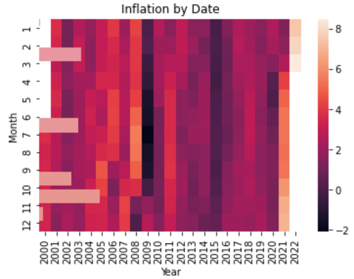
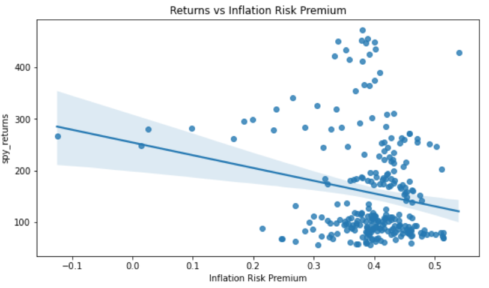
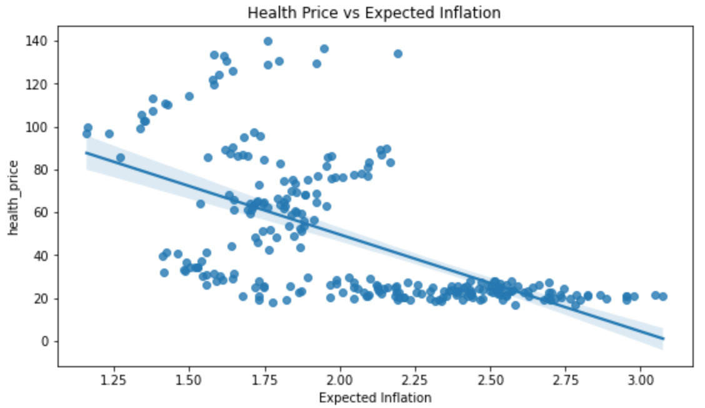
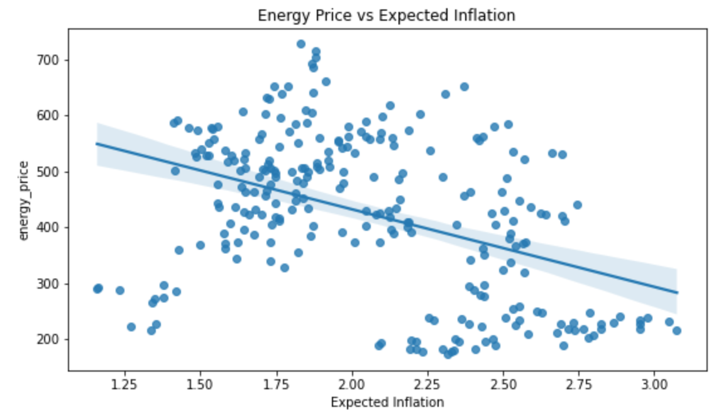

# [ColeAndFriendz](https://chasecarlson2.github.io/ColeAndFriendz.github.io/) Team Project Website

This is a website to showcase our final project for FIN 377 - Data Science for Finance course at Lehigh University.

To see the complete analysis file click [here](https://github.com/chasecarlson2/ColeAndFriendz.github.io/blob/8281b73a895d26380c0be030efd4ac2b9895a312/notebooks/model_analysis.ipynb).

## Table of contents
1. [Introduction](#introduction)
2. [Methodology](#meth)
3. [Section 2](#section2)
    1. [Subsection](#subsec2-1)
    2. [Subsection](#subsec2-2)
4. [Analysis Section](#section3)
5. [Summary](#summary)

## Introduction  <a name="introduction"></a>

The main goal of this project is to use the comprehensive CPI dataset to predict monthly stock prices for the S&P 500 index as well as for specific sectors within the index. Using measurements such as monthy % changes, real risk premium, and inflation risk premium alongside inflation predictor variables, we aim to reach an R^2 value of .8 or greater. By aiming for an R^2 we do realize we are giving ourselves some room for error.

## Methodology <a name="meth"></a>

Here are some graphs developed from our dataset representing historical inflation by date and sector price vs. expected inflation correlation. 


<br><br>
Some analysis here
<br><br>

<br><br>
More analysis.

<br><br>
More analysis

<br><br>
More analysis

## Section <a name="section2"></a>
Blah blah

### Subsection 1 <a name="subsec2-1"></a>
This is a subsection, formatted in heading 3 style

### Subsection 2 <a name="subsec2-2"></a>
This is a subsection, formatted in heading 3 style

## Analysis Section <a name="section3"></a>

Below is the code used to create our predictive model.

```python
#Predictive Model

import pandas as pd
import numpy as np
import seaborn as sns
import matplotlib.pyplot as plt
from sklearn import linear_model
from sklearn.compose import ColumnTransformer
from sklearn.impute import SimpleImputer
from sklearn.model_selection import train_test_split, GridSearchCV
from sklearn.pipeline import make_pipeline
from sklearn.preprocessing import StandardScaler

df2 = pd.read_csv("final_df.csv")
y = df2.spy_returns
y = y.iloc[1:]
housing = df2.drop('spy_returns', axis=1)
housing = housing[:-1]

rng = np.random.RandomState(0)
X_train, X_test, y_train, y_test = train_test_split(housing, y, random_state=rng, train_size=0.8)

numeric_cols = ['expected_real_estate', 'expected_energy', 'expected_health', 'RE_inflat_ratio', 'energy_inflat_ratio',
                'heath_inflat_ratio', 'actual_inflation', #'real_estate_price', 'health_price', 'energy_price',
                'real_estate_inflation', 'health_inflation', 'energy_inflation', 'Expected Inflation',
                'Real Risk Premium', 'Inflation Risk Premium']
numeric_pipe = make_pipeline(SimpleImputer(strategy='mean'), StandardScaler())
preproc_pipe = ColumnTransformer(
    [  # arg 1 of ColumnTransformer is a list, so this starts the list
        # a tuple for the numerical vars: name, pipe, which vars to apply to
        ("num_impute", numeric_pipe, numeric_cols),
        # a tuple for the categorical vars: name, pipe, which vars to apply to
    ]
    ,  # ColumnTransformer can take other args, most important: "remainder"
    remainder='drop'  # you either drop or passthrough any vars not modified above
)
pipe = make_pipeline(preproc_pipe, linear_model.ElasticNet(random_state=rng))
for i in pipe.get_params():
    print(i)
param_1_List = [0.0150, 0.0151, 0.0152, 0.0153, 0.0154, 0.0155, 0.0156, 0.0157]
param_2_List = [0.1, 0.2, 0.3, 0.4, 0.5, 0.6, 0.7, 0.8, 0.9]
parameters = {'elasticnet__alpha': param_1_List, 'elasticnet__l1_ratio': param_2_List}
grid_search = GridSearchCV(estimator=pipe,
                           param_grid=parameters,
                           #cv=10
           )
grid_search.fit(X_train, y_train)
print("The optimized parameters output of the grid search are:")
print(grid_search.best_params_)
print("The score of the optimized output of the grid search on the training data is: " + str(grid_search.best_score_))
scores = grid_search.score(X_test, y_test)
print("Using our optimized model, the R2 score on the hold out data is: " + str(scores))
predictions = grid_search.best_estimator_.predict(X_test)
index = 0
for i in predictions:
    y_test_value = y_test.iloc[[index]].values[0]
    print("Predicted:" + str(i) + " Actual: " + str(y_test_value) + " Difference: " + str(i-y_test_value))
    index = index + 1
```

From this model, we acheived an R2 of **.5082863**.

Here are some graphs that we created in our analysis. We saved them to the `pics/` subfolder and include them via the usual markdown syntax for pictures.


## Summary <a name="summary"></a>

Blah blah


## About the team


<br>
Julio is a senior at Lehigh studying finance.
<br><br><br>

<br>
Don is an assistant professor at Lehigh.


## More 

To view the GitHub repo for this website, click [here](https://github.com/donbowen/teamproject).
